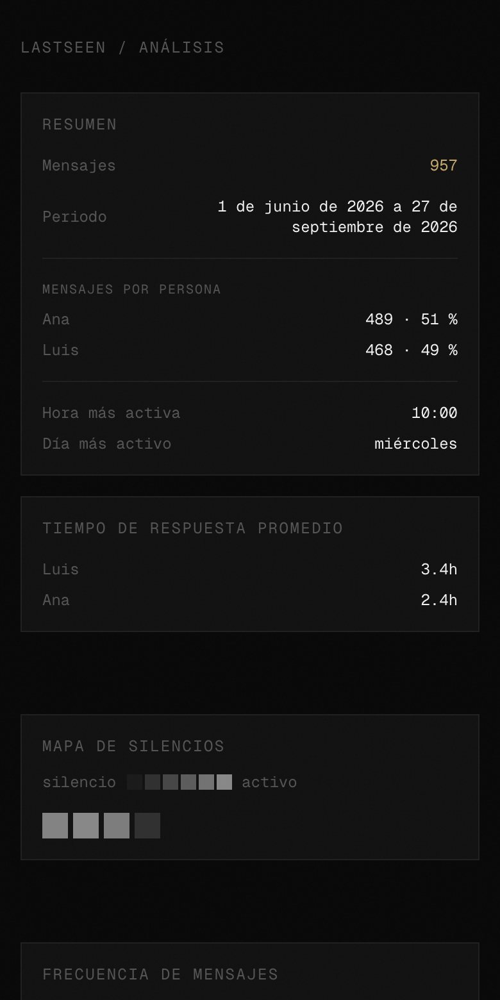
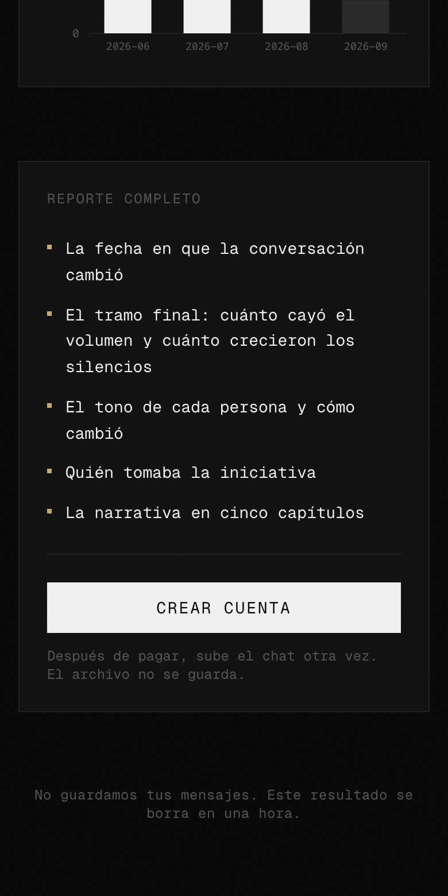
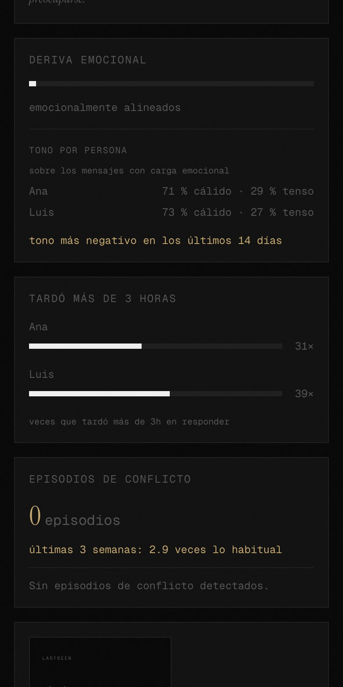
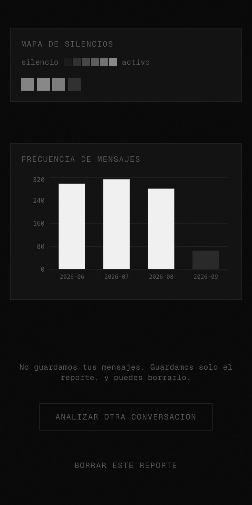
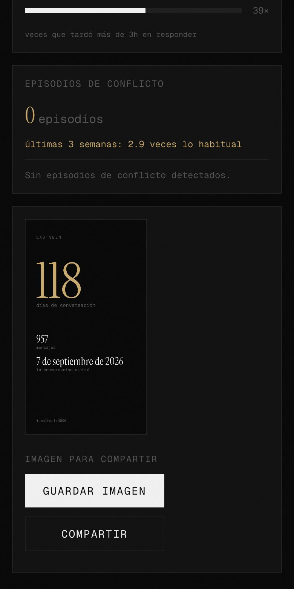

<div align="center">
<br/>

```
▄▄▄▄▄▄▄▄▄▄▄▄▄▄▄▄▄▄▄▄▄▄▄▄▄▄▄▄▄▄▄▄▄▄▄▄▄▄▄
█  ░░░░  ░  ░░░░  ░░░░░░░  ░░░░  ░░░░  █
█  ▄▄▄▄  █  ████  ████████  ▄▄▄▄  ████  █
█  ████  █  ████  ████████  ████  ████  █
█▄▄▄▄▄▄▄▄▄▄▄▄▄▄▄▄▄▄▄▄▄▄▄▄▄▄▄▄▄▄▄▄▄▄▄▄▄▄▄█

     L  A  S  T  S  E  E  N  ·  F R O N T E N D
```

<br/>

### *The part you feel.*

<br/>

[](.)
[](.)

</div>

---

<br/>

> Numbers don't move people. Stories do.
> This is where the numbers become a story.

<br/>

The frontend for LASTSEEN, a cinematic dark interface that takes the analysis from the backend and reveals it in chapters. Built to feel like watching a film, not reading a dashboard.

<br/>

---

<br/>

<div align="center">

```
 /          ──  landing
 /auth       ──  register · login
 /upload     ──  drag & drop .txt
 /analysis   ──  the experience
      │
      ├── chapter 1 ── loading   "Reading the silences..."
      │
      ├── chapter 2 ── narrative  typewriter · auto-advance · skip
      │                           prev / next in manual mode
      │
      ├── chapter 3 ── metrics    initiative balance · double text
      │                           response decay · silence onset
      │                           emotional drift · tone per person
      │
      └── chapter 4 ── charts     emotional timeline · silence map
                                  message frequency
```

</div>

<br/>

---

<br/>

## Screenshots

Taken with a synthetic chat between two invented people (Ana and Luis). No real conversation appears here.

<table>
<tr>
<td align="center"><br/><sub>Landing</sub></td>
<td align="center"><br/><sub>Free preview: counts and schedules</sub></td>
<td align="center"><br/><sub>What the full report adds</sub></td>
<td align="center"><br/><sub>Narrative, chapter 1 of 5</sub></td>
</tr>
<tr>
<td align="center"><br/><sub>Initiative and response decay</sub></td>
<td align="center"><br/><sub>Tone per person and conflict</sub></td>
<td align="center"><br/><sub>Silence map and message frequency</sub></td>
<td align="center"><br/><sub>Share card</sub></td>
</tr>
</table>

<br/>

---

<br/>

## Key design decisions

**→ The revelation sequence is non-negotiable**
Content appears in chapters, not all at once. The narrative types itself before the data appears. The data appears before the charts. This pacing is the product.

**→ Two modes in the narrative**
Auto mode: typewriter plays, advances every 1.1s. The moment you interact (skip, prev, next) it switches to manual mode: instant text, free navigation, no going back to auto.

**→ Initiative balance, corrected**
The metric tracks who breaks the silence after the *other* person was the last to speak, not just who messages first. Plus: who double-texted (followed up without a response).

**→ Two languages, one toggle**
Spanish by default (`/es`). English available (`/en`). Browser language detection via middleware. Toggle in the UI.

<br/>

---

<br/>

## Stack

| Layer | Technology |
|---|---|
| Framework | Next.js 14 · App Router · TypeScript strict |
| Styles | TailwindCSS · CSS custom properties |
| Motion | Framer Motion |
| Charts | Recharts · D3.js |
| i18n | next-intl (es · en) |
| Fonts | Instrument Serif · Geist Mono |
| Auth | httpOnly cookie via Next.js API routes |
| Deploy | Railway → AWS |

<br/>

---

<br/>

## Privacy, by design

- The frontend never stores message content
- JWT lives in an httpOnly cookie, never localStorage
- All analysis happens server-side before the frontend sees anything

*You share something intimate. We treat it that way.*

<br/>

---

<br/>

<div align="center">

```
━━━━━━━━━━━━━━━━━━━━━━━━━━━━━━━━━━━━━━━━━━━━━━━
  v0.1  landing + auth + upload        [ ████████ ]
  v0.2  4-chapter analysis reveal      [ ████████ ]
  v0.3  i18n español · english         [ ████████ ]
  v0.4  payments UI (Stripe)           [ ░░░░░░░░ ]
  v1.0  public launch                  [ ░░░░░░░░ ]
━━━━━━━━━━━━━━━━━━━━━━━━━━━━━━━━━━━━━━━━━━━━━━━
```

<br/>

*Currently in development.*

<br/>

---

*Some conversations end before the last message.*
*LASTSEEN shows you exactly when.*

</div>
