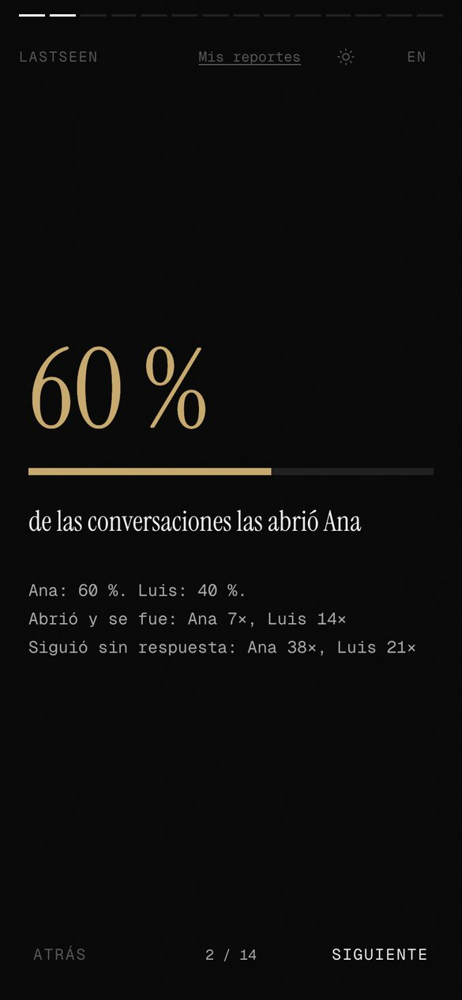

# LastSeen frontend

Next.js interface for LastSeen: upload an exported WhatsApp chat and read the report as full-screen chapters, one finding per screen. The analysis runs in [lastseen-back](https://github.com/reeenatamc/lastseen-back).

<table>
<tr>
<td align="center"><br/><sub>Landing</sub></td>
<td align="center"><br/><sub>Free preview</sub></td>
<td align="center"><br/><sub>What the full report adds</sub></td>
<td align="center"><br/><sub>Who starts the conversations</sub></td>
</tr>
<tr>
<td align="center"><br/><sub>The date it changed</sub></td>
<td align="center"><br/><sub>Tone per person</sub></td>
<td align="center"><br/><sub>Narrative chapter</sub></td>
<td align="center"><br/><sub>Share card</sub></td>
</tr>
</table>

Screenshots use a synthetic chat between two invented people.

## Pages

| Route | What it does |
|---|---|
| `/` | Landing |
| `/auth` | Register, login, Google Sign-In |
| `/upload` | Drop the .txt (max 20 MB), pick language and date range |
| `/upload/result` | Guest preview in four screens: counts, response times, activity, and what the full report adds |
| `/analysis/[id]` | Report as 14 full-screen chapters: summary, initiative, response time, turning point, closing phase, tone, conflict, activity, five narrative chapters, share card. Move with the buttons, arrow keys or a swipe. Locked reports show the preview and the credit packs |
| `/analyses` | Saved reports, with delete |
| `/legal` | Privacy and terms |

Spanish by default (`/es`), English at `/en`.

## Stack

Next.js 16 (App Router), TypeScript, Tailwind 4, next-intl, Framer Motion, Recharts.

## Run locally

```bash
npm install
NEXT_PUBLIC_API_URL=http://localhost:8000 npm run dev
```

Set `NEXT_PUBLIC_GOOGLE_CLIENT_ID` to enable Google Sign-In. Checks: `npx tsc --noEmit` and `npm run build`.

## Security and privacy

- The session JWT lives in an httpOnly cookie that expires with the token.
- Security headers on every route, including a Content Security Policy.
- Auth routes reject cross-origin requests.
- The checkout redirect only accepts Lemon Squeezy URLs over HTTPS.
- The chat file is read in the browser only to detect its date range, then sent to the backend. No chat content is kept in browser storage.

Code under MIT.
